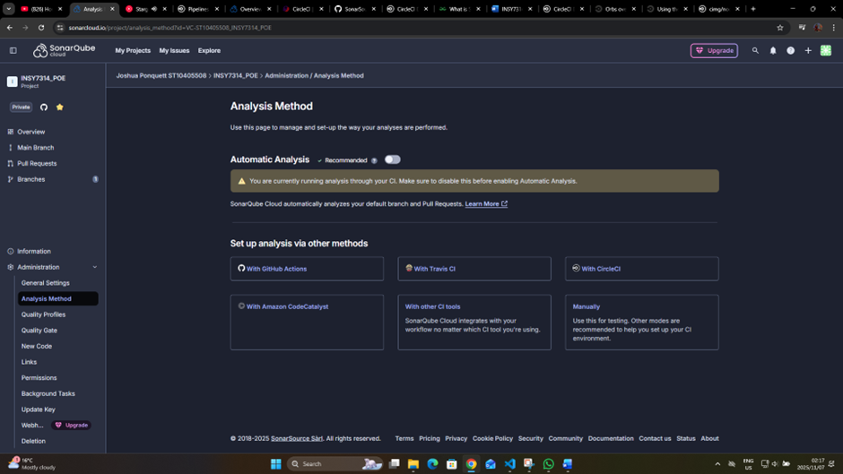
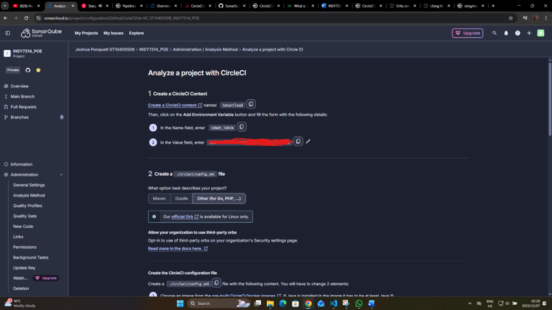
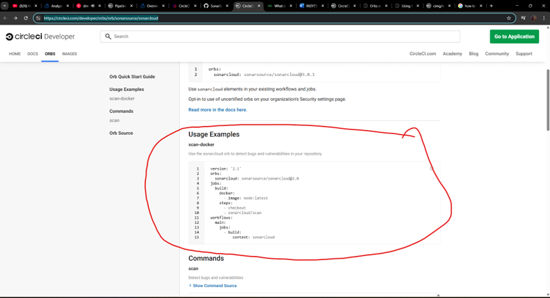

# Introduction:
In this document, I will walk you through the steps I took to implement the CircleCI pipeline with SonarQube. I used various videos and documentation provided by the creators of CircleCI and SonarQube to complete this task. If you want to report any other security issues not mentioned in the SonarQube file. please contact us through our github emails.
# CircleCI:
## Start:
For CircleCI it was basic. These were the steps I followed (CircleCI, 2021):
-	You basically go to their site and Sign-in with your GitHub account.
-	  Then go to your applications. This will show you your repositories and allow you to pick whichever one you want to add the CircleCI pipeline to. 
-	I chose the Hello-world yaml file – basically its just a straightforward yaml file that tests running hello world through your GitHub and pipeline
## More towards your project:
At this point you already have the circleCI pipeline but need to make it useful for your project. This is how I kinda did it (CircleCI, 2021):
- Added a node version displayer – this will show the version of the node. I am using MERN, so I also utilized their predefined docker image to help build the environment for the CircleCI pipeline.
-	Add npm install command – I did this for both backend and frontend. They don’t share a package.json file. We are keeping them separate cause they might require different versions of same packages, and we want easy maintainability and scalability.
# SonarQube:
The SonarQube is also added to the CircleCI pipeline so that it automatically runs everytime a new integration of the code is made (SonarSource, 2025). Thus, making our project utilize the full capabilities of the CI/CD pipeline. I did this by doing the following:
## Setting up SonarQube and preparing for CircleCI pipeline:
- Create a sonar cloud account – I just used my github account for this too so that I could easily link it to the github repository where the circleCI pipeline is.
- From there I figured out how to run a scan on my Github repository. However, I needed this to work through an API or something else for the CircleCI pipeline.
- That’s when I found the Analysis method section
 
Figure 1
- I saw the “With CircleCI”. When you click it it will take you to a page that provides you with how to setup SonarQube to work with the CircleCI pipeline. It is really easy to do.
 
Figure 2
- As you can see in figure 2, it tells you the steps to follow. I followed those steps and added the SonarCloud context to my circleCI project – this is done on the site. I think there is a way to do it through the yaml file but its better security to do it through the context. It keeps your environment variables and API keys private. I learnt that during my hackathon where I had to publish a project. I used render which has an environment section.
## Implementing to CircleCI pipeline – github:
Now comes the tricky part (not really but it can cause errors with typos/syntax errors). These are the steps:
-	You first need to setup orbs. Orbs are a form of shareable package, like a library, that you can use to simplify the building process of CircleCI pipelines (CircleCI Developer, 2025). This is achieved by going to the CircleCI developer documentation - I hyperlinked the text so you can click on it to go to the site (CircleCI Developer, 2025).
-	Once you are on the site you pretty much copy paste what it has. Specifically the section shown in figure 3.
 
Figure 3
- Very Important. The build: context: SonarCloud   - this part is case sensitive. I found this out the hard way. I spent an hour debugging trying to test and figure out why it didn’t work. My context was sonarcloud in the yaml file. However, on the CircleCI project context, the context setup in figure 2, I named it SonarCloud. This making it does not recognize the context path as its case sensitive.
It should work now. If you get any errors they should be pretty easy to debug based on the error code.

# Reference List:
CircleCI. 2021. How to get started with CircleCI. [video online] Available at: https://www.youtube.com/watch?v=Js3hMUsSZ2c&list=PL9GgS3TcDh8x6tcY7HDq2zmEx0fAtwWsM&index=1  [Accessed 6 November 2025].
CircleCI. 2018. Configure multiple jobs with Workflows on CircleCI. [video online] Available at: https://www.youtube.com/watch?v=3V84yEz6HwA&list=PL9GgS3TcDh8x6tcY7HDq2zmEx0fAtwWsM&index=6  [Accessed 6 November 2025].
CircleCI. 2021. How to get your first green build on CircleCI. [video online]. Available at: https://www.youtube.com/watch?v=lMKDkS8uATc&list=PL9GgS3TcDh8x6tcY7HDq2zmEx0fAtwWsM&index=2 [Accessed 6 November 2025].
CircleCI Developer. 2025. Orbs. [Online]. Available at: https://circleci.com/developer/orbs [Accessed 6 November 2025].
CircleCI Developer. 2025. sonarsource/sonarcloud@3.0.1 .  [Online]. Available at: https://circleci.com/developer/orbs/orb/sonarsource/sonarcloud [Accessed 6 November 2025].
SonarSource. 2025. sonarcloud-circleci-orb. [Online]. Available at: https://github.com/SonarSource/sonarcloud-circleci-orb/blob/master/README.md [Accessed 6 November 2025].
